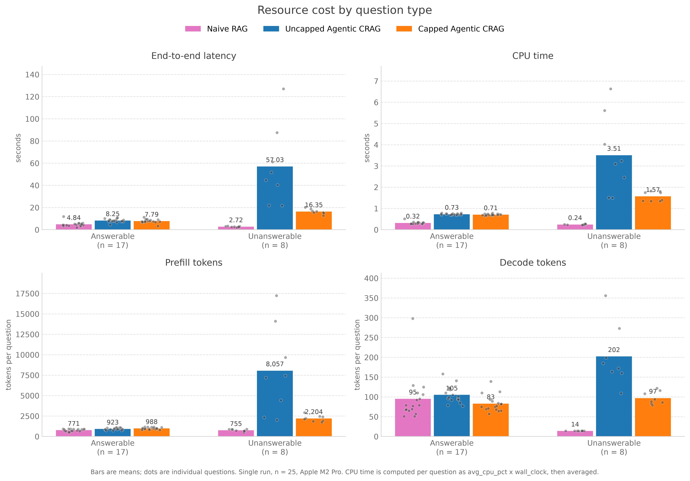

# Localizing Agentic Workflows: Hardware-Constrained Corrective RAG for Secure Corporate Data Handling

MSc Computer Science Dissertation project at the University of Birmingham.  
This repository implements and evaluates three fully localized Retrieval-Augmented Generation (RAG) architectures—Naive RAG, an Uncapped Agentic CRAG baseline, and Capped Agentic CRAG—designed for corporate compliance and privacy-restricted environments (such as GDPR compliance policy processing) with zero external cloud dependencies or telemetry.

---

## Motivation and Research Questions

Agentic Corrective RAG (CRAG) frameworks introduce dynamic grading and query-rewriting loops to self-correct retrieval failures. While effective in cloud-hosted environments backed by elastic compute, deploying iterative agentic workflows on resource-constrained on-premise hardware creates an unbounded compute bottleneck:
* **The Infinite Loop Trap:** In privacy-restricted settings where external web search fallbacks are prohibited, ambiguous or unanswerable queries force the agent into non-terminating rewrite-and-retrieve loops against the local vector database.
* **Cascading Compute Burden:** Each iteration accumulates conversational context, inflating autoregressive decoding latency, memory footprint, and cumulative energy consumption on local hardware.

### Core Research Questions (RQs)
1. **RQ1 (Self-Correction vs. Single-Pass):** On a fully local 8B model, what differences in generation quality and refusal behaviour does an Agentic CRAG architecture employing a self-correction loop exhibit relative to a single-pass Naive RAG architecture?
2. **RQ2 (Cost of the Iteration Cap):** What effect does a state-enforced iteration cap have on local resource consumption (latency, CPU time, memory, tokens) relative to an uncapped control? On which question types does the loop actually fire, and what form do its cascading failures take?
3. **RQ3 (Resource–Quality Relationship):** What relationship holds between hardware load metrics (CPU, memory, latency) and the four RAGAS quality scores?

---

## Evaluated Architectures

| Architecture | Control Flow | Self-Correction | Behavior on Unanswerable Queries |
| :--- | :--- | :--- | :--- |
| **Naive RAG** | Single-pass retrieve -> generate | None | Refuses correctly on all 8, at 14 completion tokens each (a fixed template); mean 2.72s |
| **Uncapped Agentic CRAG** | Retrieve -> grade -> rewrite loop, no state cap | Unconstrained retry | Mean 57.03s, worst case 127.06s; 2 of 8 halted only by the harness rather than converging |
| **Capped Agentic CRAG (Proposed)** | LangGraph state-enforced cap (K=2) with graceful fallback | Controlled | Mean 16.35s, worst case 20.22s, closing with `give_up_msg` |

---

## System Architecture and Technology Stack

* **Local LLM Engine:** Ollama running `llama3.1` (8B parameters, 4-bit quantized, `temperature=0` for determinism).
* **Local Embedding Model:** `nomic-embed-text` (embedding dimension: 768).
* **Vector Database:** ChromaDB with structured metadata citations (`chunk_size=1200`, `chunk_overlap=200`).
* **Agent Orchestration:** LangGraph state machine tracking `rewrite_counts` with structured Pydantic binary grading outputs.
* **Web UI and Streaming:** Django 6.0 with Server-Sent Events (SSE) streaming thinking steps and token outputs.
* **Hardware Profiling:** Background `ResourceSampler` daemon polling CPU percentage and RSS memory (0.2s interval) via `psutil`.
* **Quality Evaluation:** RAGAS 0.3.9 (Faithfulness, Answer Relevance, Context Precision, Context Recall) running offline with local LLM-as-a-judge.

---

## Repository Structure

```
.
├── RAG/                          # Django project configuration
│   ├── settings.py
│   ├── urls.py
│   ├── wsgi.py
│   └── asgi.py
├── basic/                        # Django web application (UI and SSE streaming)
│   ├── forms.py                  # QueryForm
│   ├── models.py                 # UserQuery history model (TextField)
│   ├── views.py                  # SSE streaming view (stream_view)
│   ├── urls.py
│   ├── static/                   # CSS stylesheets
│   └── templates/                # Chat interface templates
├── rag_agent/                    # Core RAG pipelines and LangGraph engines
│   ├── capped_crag.py            # Proposed Capped Agentic CRAG pipeline
│   ├── uncapped_crag.py          # Uncapped Agentic CRAG baseline
│   ├── uncapped_crag_k6.py          # Benchmark harness with safety ceiling (K=6)
│   ├── naive_rag.py              # Single-pass Naive RAG baseline
│   └── vector_store.py           # Standard chunking (1200/200): loader, ChromaDB setup and search
├── data/                         # Local compliance knowledge base
│   ├── Corporate Data Protection and GDPR Compliance Policy.pdf
│   └── vector_db/                # Persisted Chroma store, standard chunks
├── testing/                      # Decoupled experimental benchmarking suite
│   ├── resource_collector.py     # Stage 1: Hardware profiling and token collection
│   ├── ragas_tester.py           # Stage 2: Offline RAGAS quality evaluation
│   └── resource_ragas_dataset.json # 25-case multi-category evaluation benchmark
├── experiment_result/            # Recorded measurements, scores and figures
│   ├── main_experiment/          # Three architectures x 25 items
│   │   ├── *_resource_report.json    # Stage 1 hardware, latency and token records
│   │   ├── ragas_results_*.csv       # Stage 2 per-item RAGAS scores
│   │   ├── ragas_metrics_summary.json # Scores grouped by question type
│   │   ├── ragas_summary.py          # Builds the grouped summary above
│   │   └── plot_*.py                 # One script per figure
│   ├── iteration_cap/            # K=1-6 sensitivity sweep
│   │   ├── ragas_result_k_[1-6].csv  # Per-K quality scores
│   │   ├── capped_limit_log.txt      # Per-K, per-item latency log
│   │   └── plot_iteration_cap.py
│   ├── controlled_measurements/  # Two single-variable comparisons, n=3 each
│   │   ├── orig_2.json, refined_2.json   # Rewrite prompt A/B (§4.2.2)
│   │   ├── 2_iters.json, 6_iters.json    # Iteration depth K=2 vs K=6 (§5.5.1)
│   │   ├── txt/                          # Raw per-run sampler output
│   │   └── plot_controlled_measurements.py
│   ├── warmup/                   # Warm-up convergence record
│   │   ├── warmup_run_times.json     # Per-run latency, 15 consecutive calls
│   │   ├── warmup_log.txt            # Raw sampler output for the same 15 runs
│   │   └── plot_warmup.py
│   └── figures/                  # Figures reproduced in the dissertation
├── manage.py
├── requirements.txt
└── README.md
```

---

## Quick Start and Installation

### 1. Prerequisites
* Python 3.10 or higher
* [Ollama](https://ollama.com/) installed and running locally

```bash
# Pull local models into Ollama
ollama pull llama3.1
ollama pull nomic-embed-text
```

### 2. Environment Setup
```bash
# Clone the repository
git clone https://git.cs.bham.ac.uk/projects-2025-26/kxy500.git
cd kxy500

# Create and activate virtual environment
python3 -m venv .venv
source .venv/bin/activate    # On Windows: .venv\Scripts\activate

# Install dependencies
pip install -r requirements.txt
```

### 3. Running the Django Web Application
```bash
# Run database migrations
python manage.py migrate

# Launch local development server
python manage.py runserver
```
Visit `http://127.0.0.1:8000/` in your browser. You can test different architectures using the mode selector or URL parameter:
* Capped Agentic CRAG (Default): `http://127.0.0.1:8000/?mode=capped`
* Uncapped Baseline: `http://127.0.0.1:8000/?mode=uncapped`
* Naive RAG Baseline: `http://127.0.0.1:8000/?mode=naive`

---

## Reproducing Experiments (Two-Stage Evaluation)

To ensure zero timing interference from evaluation logic, experiments are decoupled into two distinct offline stages:

### Stage 1: Hardware and Response Profiling
Executes the target architecture against the 25 benchmark queries (12 Single-hop, 5 Multi-hop, 8 Unanswerable), logging wall-clock latency, CPU percentage, Peak RAM, and Prefill/Decode tokens into a unified JSON report:
```bash
python testing/resource_collector.py
```
*(Stops Ollama to clear the KV cache and re-warms the pipeline every 3 queries — 3 warm-up runs at the start of a batch, 1 on each subsequent reset — to eliminate cross-question cache drift; see §3.3 of the dissertation).*

### Stage 2: Offline Quality Scoring (RAGAS)
Reads the pre-recorded JSON report from Stage 1 and executes deterministic RAGAS evaluation offline:
```bash
python testing/ragas_tester.py
```
Outputs final scores to `ragas_results_<condition>.csv`. The recorded outputs of both
stages, together with the K-sweep and warm-up records and the figures derived from them,
are kept under `experiment_result/`.

---

## Key Experimental Findings

1. **Latency Containment on Unanswerable Queries** (8 unanswerable items of the 25-question benchmark):
   * **Capped CRAG (K=2):** bounded latency to a mean of **16.35s**, worst case **20.22s**.
   * **Uncapped CRAG:** mean **57.03s**, worst case **127.06s** (Case ID 20).
   * The uncapped loop does not terminate on its own: on Case IDs 17 and 20 it reached `llm_calls` = 22, exactly the ceiling implied by the harness's safety cap of K=6, meaning it was halted rather than converged. The gaps reported here are therefore **lower bounds** on the cost of a genuinely uncapped implementation.

   

   *Bars are means, dots individual questions. Single run, n = 25, Apple M2 Pro.
   While retrieval succeeds the three architectures are close together; once it
   cannot, they separate by roughly an order of magnitude. What the cap buys is
   visible in the spread as much as in the mean: on the unanswerable subset the
   uncapped baseline ranges from 21.74s to 127.06s, the capped architecture from
   12.78s to 20.22s. Mean CPU utilisation is deliberately not plotted — it is a
   rate diluted by the sampling window, and on this subset it ranks the uncapped
   baseline as the most economical, which reverses once expenditure is measured
   as CPU time. Reproduce with `experiment_result/main_experiment/plot_question_type.py`.*

2. **Computational Cost Substitution (Prefill vs. Decode):**
   * Capped CRAG pays an upfront compute-bound Prefill cost during grading/rewriting to prune context, eliminating Naive RAG's memory-bandwidth bound "Context Dumping" (e.g., 298 decode tokens reduced to 89 tokens on Case ID 13).
3. **Prompt Refinement Efficiency:**
   * Enforcing strict negative constraints on intermediate rewrite prompts eliminated preamble bloat, reducing 2-iteration rewrite latency by **~43%** (15.42s -> 8.77s).

---

## Citation


```
Yu, K.-Y. (2026) 'Localizing Agentic Workflows: Hardware-Constrained Corrective RAG for Secure Corporate Data Handling', MSc Dissertation, University of Birmingham. Supervised by Wendy Yanez Pazmino.
```

---

## License
This project is developed for academic research purposes under the MSc Computer Science program at the University of Birmingham.
